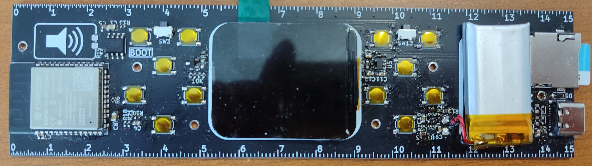
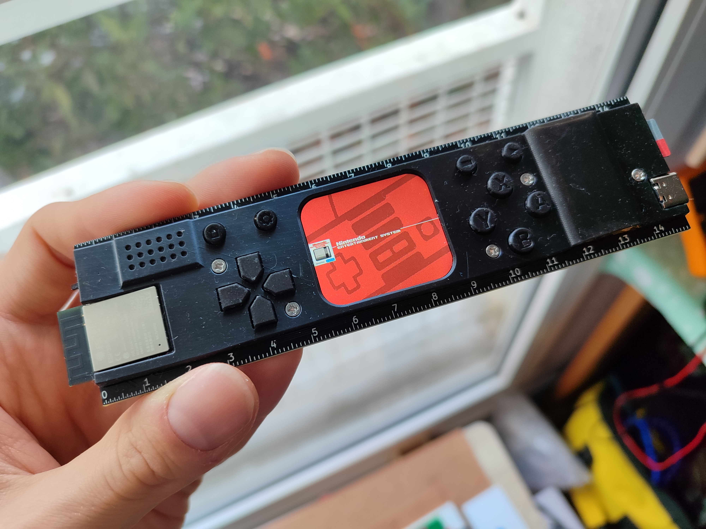
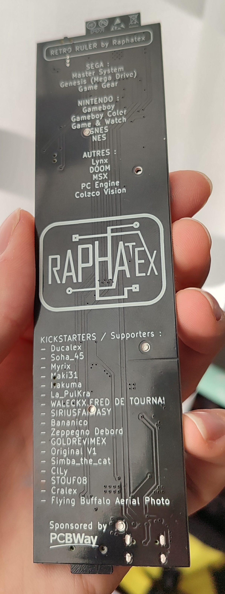
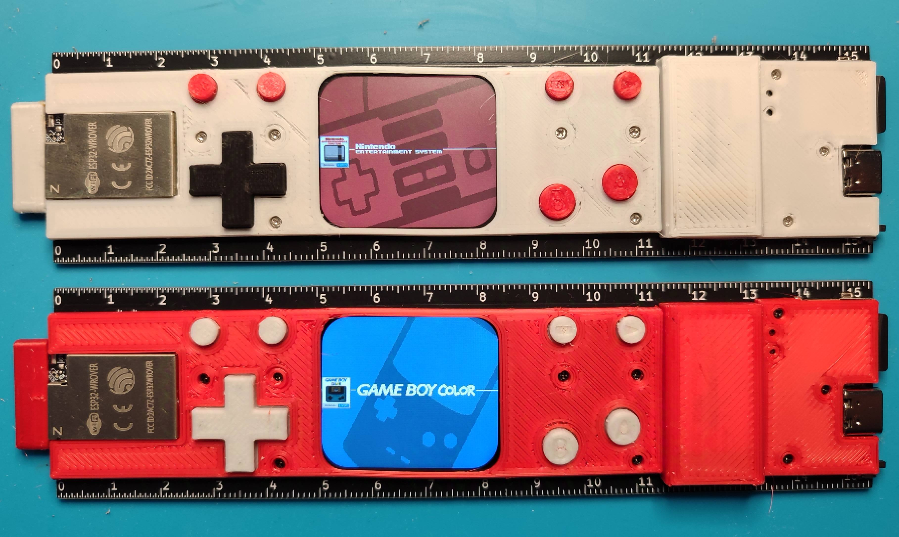
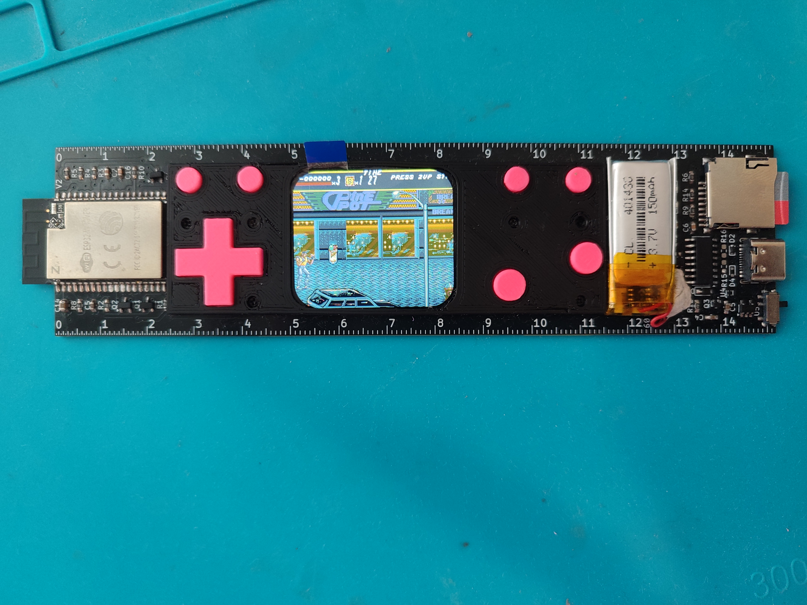

# Retro-Ruler
## PCB ruler featuring an ESP-32 module, 1.69" IPS screen running retro-go
## <https://github.com/ducalex/retro-go>

I'm currently working on a new version with the new ESP32-S3, here is a picture of my current prototype.

## Specs:
<pre>
- battery : 210 mAh -> 2h battery life
- MCU : ESP32-S3 8MB ram 16MB flash
- USB-C : charge (TP4054) and program
- Micro SD : store games
- 12 buttons for input (1 for ON/OFF) + 2 shoulders
- 1.69 inch IPS screen with round corners
- 0.7W speaker
- NS4168 I²S DAC + Amplifier
</pre>

Older prototype (fully assembled) shell and buttons were resin printed.

PCBway sent me free PCBs for prototyping, a huge thanks to them!
Check out their website if you need cheap (and high quality) PCB prototyping.
https://www.pcbway.com
They spend more time checking your design files to avoid errors compared to JLCPCB!

The quality of the soldermask is incredible (in my opinion way better than the matte finish from JLCPCB).
PCBway also does multicolor silkscreen wich I haven't tried personally...for now!

## Specs of the first "kickstarter version" :
<pre>
- battery : 230 mAh -> 2h battery life
- MCU : ESP32 wrover 8MB ram 8MB flash
- USB-C : charge (TP4057) and program (CH340C)
- Micro SD : store games
- 10 buttons for input
- 1.69 inch IPS screen with round corners
</pre>

## Photos of the first "kickstarter version":
(regular FDM 3D printed shell)

## First prototype:

